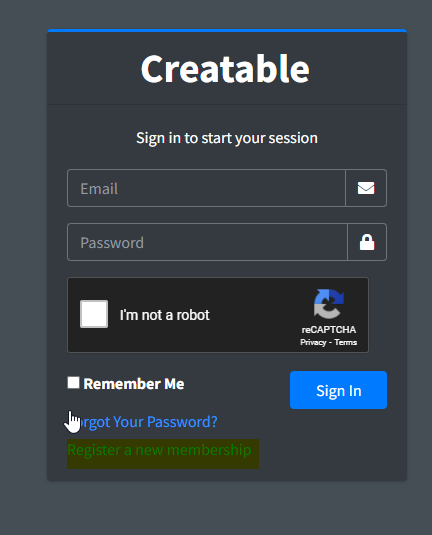

# Creatable Guide
## Terminology
Welcome to Creatable host, let's get started.
First, let's understand some basic terminology.
1. Backups - Offsite backups powered by SnailDOS
2. Creatable Coins - Creatable coins allow you to buy better servers with more specs
3. Creatable Mining - Mining crypto in return of Creatable Coins
4. Our Software - Created by SnailDOS, software allows you to speed your productivity
## Software
Now we understand basic Creatable terminology, Let's get started by creating our first server.
You can create a server with our website but we highly recommend our software.
Currently, our support for software will not work on any apple devices.
[SnailPortal App (PC)](https://github.com/snaildos/SnailDOS-Desktop/releases/)
[SnailDOS App (Phone)](https://idkyet.com)
## Creating a server
When you want to create your first server, you **need** to join our discord, this is the one requirment of using Creatable host, leaving the discord will result in your server getting suspended.
[Join Our Discord](https://invite.gg/snaildos)
When you have joined the server, you will want to create a Creatable account.
- [Using the website](https://server.snaildos.com)
- Using the SnailDOS mobile app: Press the creatable app.
- Using the Software for PC: Press the Creatable button in the menu.

When you are in the interface

Press the "Register for membership button"
Follow all the instructions to signup, then press register.
Once done, follow all the yellow prompts to verify your email and link your discord.
Go to the "server" tab, press "Create new server" follow the prompt and package setup, then press create. You now created your server.
Server installation can take ~10 mins for the first installation.
## Setting up your own Discord bot
It's tons of things you need to do for this, and we recommend you ask for support in our discord server.
## Creatable Coins
You can buy creatable coins, join our discord and ask how.

You can also mine creatable coins by convering your PC processing power to mine Creatable coins.
If you want to mine Creatable coins, download the miner app, it works on linux, mac (m1), and Windows 10 and 11.
[Follow this guide on how to get you going!](/en/snailminer)

I mined for ~1 week now and I am happy with my progress, how can I cash out?
Join our discord, and DM our modmail, follow the instructions there.

## For technical support, what can I do?
Ask in the forums. [here](https://community.snaildos.com)
